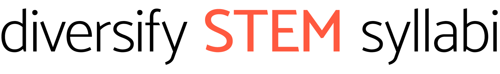
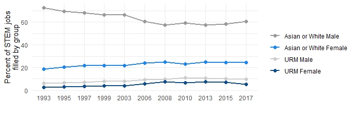

<!-- <head{#top}> -->

<!-- <script src = "Main.js"></script> -->
<!-- <link rel="stylesheet" type="text/css" href="MainStyle.css"> -->
```{r, echo=FALSE}
htmltools::includeHTML("Navbar.html")
```
<BR><BR>
   
<!-- </head> -->

```{r setupOpts, echo=FALSE}
knitr::opts_chunk$set(fig.width=12, fig.height=8, warning=FALSE, message=FALSE)
# Don't set echo to false for the overall options - r code chunks below need to appear
```

## Introduction

Data from the National Science Foundation demonstrate that women and people of color, sometimes referred to as underrepresented minorities (URM), are underrepresented in STEM fields. 

**Percentage of STEM jobs filled by group over time (NSF survey of college graduates).**<br>


One strategy to improve the visibility of underrepresented groups is to include work from underrepresented scholars in college courses. This will not only add diverse voices to the course, but will elevate women and people of color who are working as scientists and allow students who are women and people of color to see people like them as experts. When college students see themselves represented in a field they are more likely to consider it a viable career choice.

**Diversify (STEM) syllabi** can help add these voices to syllabi for STEM courses. The resources listed are sole-authored or have a lead author who is a woman or person of color (or both). Choose a STEM discipline from the top navigation to see resources in that discipline. If you know of other books or papers that could be added to the list, please send them to harrisj@wustl.edu. As the repository grows, I plan to develop a more sophistocated searchable repository, but I wanted to start somewhere!

